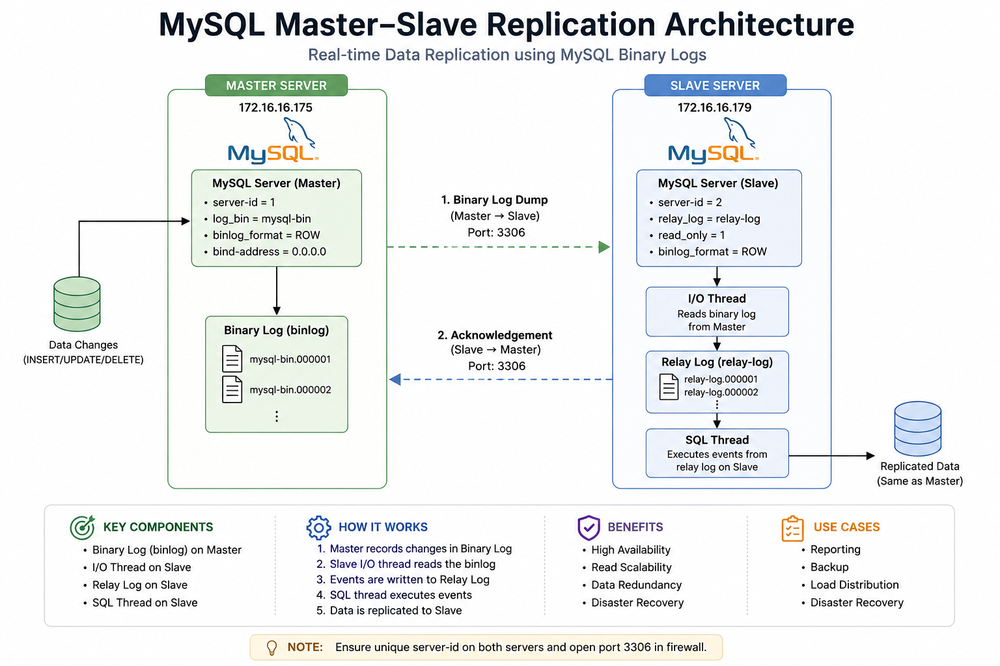

# 🧱 MySQL Master–Slave Replication (Production-Style DevOps Project)

## 🚀 Overview

This project demonstrates a **production-oriented MySQL Master–Slave replication setup** across two Ubuntu machines.

It goes beyond basic setup by covering:

* Real-time data replication
* Backup & restore strategies
* Failure simulation and recovery
* Debugging real-world replication issues

---

## 🏗️ Architecture



> Master–Slave replication using MySQL binary logs
---

## 🛠️ Tech Stack

* MySQL 8.x
* Ubuntu Linux
* Bash scripting
* Networking (TCP/IP, firewall)

---

## ⚡ Quick Start (High-Level)

1. Configure Master
2. Configure Slave
3. Take backup from Master
4. Restore on Slave
5. Start replication

Verify:

```sql
SHOW SLAVE STATUS\G
```

---

## 📂 Project Structure

```text
configs/       → MySQL configuration files  
scripts/       → Automation scripts  
docs/          → Detailed step-by-step setup  
test-cases/    → Validation scenarios  
README.md      → Project overview  
```

---

## 🔧 Configuration Highlights

### Master

* Binary logging enabled
* Unique `server-id=1`

### Slave

* Relay logs enabled
* Unique `server-id=2`
* Read-only mode enabled

---

## 🧪 Test Cases

This project includes hands-on validation:

* ✅ Basic replication (insert → sync)
* ✅ Bulk data replication
* ✅ Slave downtime & recovery
* ✅ Backup & restore validation
* ✅ Replication break simulation

---

## 🚨 Troubleshooting (Real Issues Covered)

During implementation, the following real-world issues were encountered and resolved:

* ❌ MySQL service not running
* ❌ `server-id` conflict
* ❌ GTID mismatch errors
* ❌ Authentication plugin (`caching_sha2_password`) issue
* ❌ Duplicate entry error (Error 1062)
* ❌ Slave IO thread not running
* ❌ Slave SQL thread stopped
* ❌ Dump file transfer issues
* ❌ Permission issues during backup

👉 Solutions for each are documented in `docs/05-troubleshooting.md`

---

## 🔄 Scripts

### Check replication status

```bash
./scripts/check_replication.sh
```

---

### Backup database

```bash
./scripts/backup.sh
```

---

### Restore database

```bash
./scripts/restore.sh
```

---

## 🧠 Key Learnings

* Understanding MySQL replication internals:

  * Binary logs (binlog)
  * IO thread
  * SQL thread

* Importance of data consistency

* Handling replication failures in real environments

* Debugging distributed database systems

---

## 🚀 Future Improvements

* GTID-based replication (modern approach)
* Docker Compose setup
* Monitoring with Prometheus + Grafana
* Automated failover (Orchestrator / MHA)
* Ansible automation

---

## 📌 Use Case

This project is ideal for:

* DevOps Engineers learning database replication
* Backend engineers working with distributed systems
* Interview preparation (real-world scenarios)

---

## 👨‍💻 Author

Abhishek  
DevOps Engineer | Cloud & Automation Enthusiast

---

## ⭐ Support

If this project helped you, consider giving it a ⭐ on GitHub!

